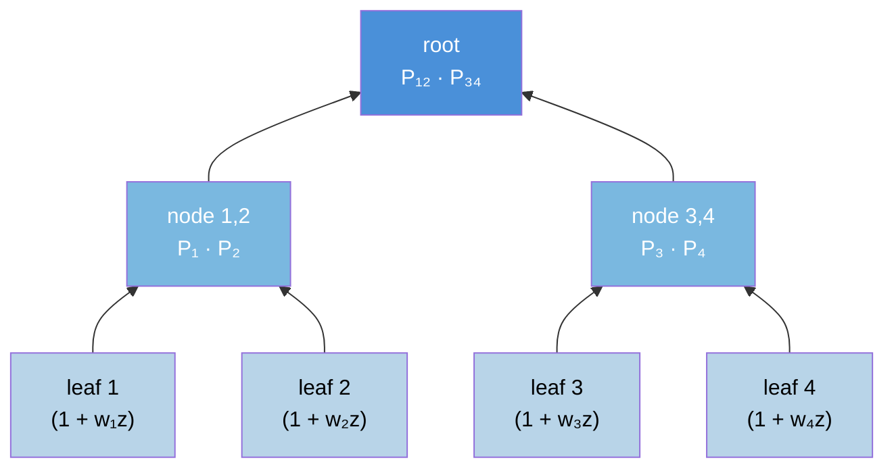
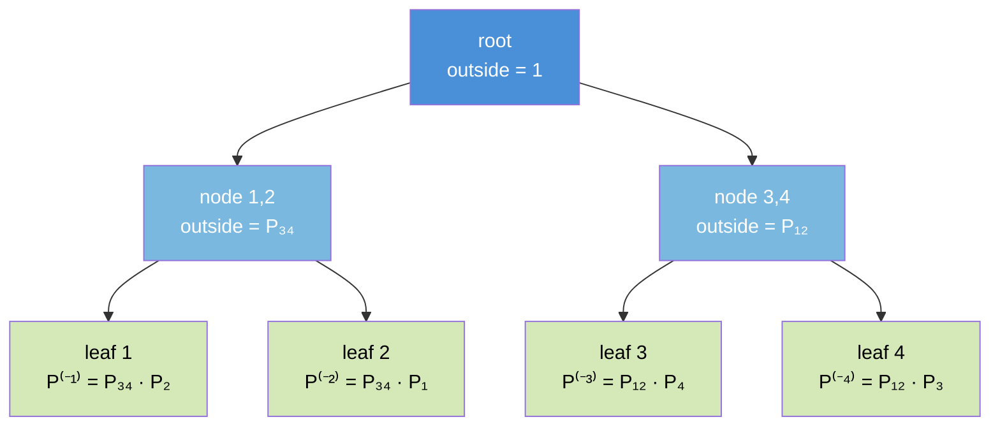
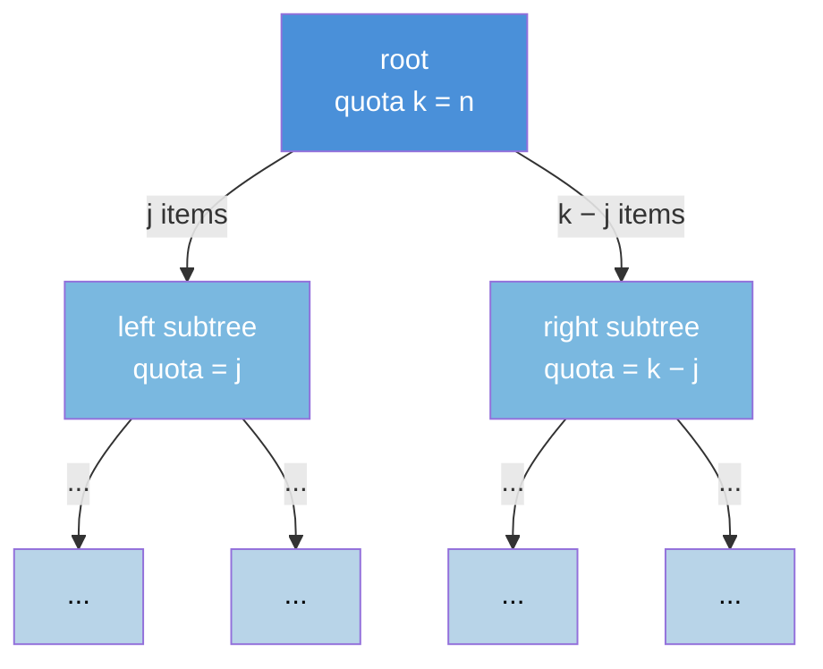

# Conditional Poisson Sampling

Sample random subsets of exactly $n$ items from a universe $\mathcal{S}$ of $N$ items, where each item $i$ has a specified inclusion probability $\pi_i$.

Given a weight vector $\boldsymbol{w} = (w_1, \dots, w_N)$ with $w_i > 0$, the probability of drawing a particular subset $S \in \binom{\mathcal{S}}{n}$ is proportional to the product of its weights:

$$P(S) = \frac{\prod_{i \in S} w_i}{Z\tbinom{\boldsymbol{w}}{n}}, \quad S \in \tbinom{\mathcal{S}}{n}$$

where $Z\binom{\boldsymbol{w}}{n} = \sum_{S \in \binom{\mathcal{S}}{n}} \prod_{i \in S} w_i$ is the normalizing constant — a weighted generalization of the binomial coefficient (when $\boldsymbol{w} = \mathbf{1}$, we recover $Z\binom{\mathbf{1}}{n} = \binom{N}{n}$).

This is the **conditional Poisson distribution** (also called the *exponential* or *maximum-entropy* fixed-size design). It arises by running independent Bernoulli trials — include item $i$ with probability $p_i = w_i/(1+w_i)$ — and conditioning on exactly $n$ items being selected. The weight $w_i$ is the *odds* of the $i$-th coin flip: $w_i = p_i / (1 - p_i)$.

## Installation

Single-file library — copy `conditional_poisson.py` into your project, or install from a local clone:

```bash
pip install .
```

Requires Python 3.8+ and NumPy.

## Usage

```python
import numpy as np
from conditional_poisson import ConditionalPoisson

# From weights (Bernoulli odds)
w = np.array([1.0, 2.0, 3.0, 0.5, 1.5])
cp = ConditionalPoisson.from_weights(n=2, w=w)

# Inclusion probabilities: P(item i is in the sample)
print(cp.pi)          # shape (5,), sums to n=2

# Log-normalizer
print(cp.log_normalizer)

# Sample 1000 subsets of size 2
samples = cp.sample(1000, rng=42)   # shape (1000, 2)

# Log-probability of a specific subset
print(cp.log_prob([0, 3]))

# Hessian-vector product: Cov[Z] v
v = np.random.randn(5)
print(cp.hvp(v))
```

### Constructors

| Constructor | Description |
|---|---|
| `ConditionalPoisson(n, theta)` | Direct from log-weights `theta`, where `theta[i]` $= \log w_i$ |
| `ConditionalPoisson.uniform(N, n)` | Uniform: every item has inclusion probability $n/N$ |
| `ConditionalPoisson.from_weights(n, w)` | From weight vector $\boldsymbol{w}$ |
| `ConditionalPoisson.fit(pi_star, n)` | Find $\boldsymbol{w}$ that produces target inclusion probabilities $\pi^{\ast}$ |

### Fitting to target probabilities

A common use case: you have desired inclusion probabilities and need to find weights that achieve them.

```python
pi_star = np.array([0.6, 0.4, 0.8, 0.3, 0.9])  # must sum to n
cp = ConditionalPoisson.fit(pi_star, n=3, tol=1e-10, verbose=True)
print(np.max(np.abs(cp.pi - pi_star)))  # should be < tol
```

This solves a convex optimization problem (Newton-CG with Armijo backtracking) to find $\boldsymbol{w}$ such that the resulting inclusion probabilities match $\pi^{\ast}$.

## How it works

The key computational challenge is that $Z\binom{\boldsymbol{w}}{n}$ sums over all $\binom{N}{n}$ subsets — far too many to enumerate. This library uses a **polynomial product tree** to compute everything in $O(N \log^2 n)$ time.

The idea: encoding the sum over subsets as the $n$-th coefficient of a product of polynomials. Define one polynomial per item:

$$(1 + w_1 z)(1 + w_2 z) \cdots (1 + w_N z)$$

When you expand this product, the coefficient of $z^n$ equals $Z\binom{\boldsymbol{w}}{n}$. This polynomial product can be computed efficiently using a binary tree.

### Upward pass: building the product

Each leaf holds one factor $(1 + w_i z)$. Internal nodes multiply their children's polynomials. The root holds the full product, whose $n$-th coefficient is $Z\binom{\boldsymbol{w}}{n}$.



### Downward pass: inclusion probabilities

To compute the inclusion probability of item $i$, we need the "leave-one-out" product — the product of all factors *except* $i$. Rather than recomputing $N$ separate products, the downward pass propagates information from the root back to the leaves. Each child receives the product of its parent's outside context with its sibling's subtree:



At leaf $i$, the inclusion probability is $\pi_i = w_i \cdot \llbracket P^{(-i)} \rrbracket(z^{n-1}) / Z\binom{\boldsymbol{w}}{n}$.

### Sampling: top-down quota splitting

Sampling walks the tree top-down with a quota $k$ (starting at $n$). At each internal node, the quota is randomly split between children, weighted by their polynomial coefficients:



At each split, $j$ is drawn with probability proportional to $P_L[j] \cdot P_R[k-j]$. Leaves with quota 1 are included in the sample; quota 0 are excluded. This produces exact samples without ever building the $\binom{N}{n}$-sized probability table.

### Numerical stability

Every polynomial is stored in a scaled representation `(coeffs_norm, log_scale)` with $\max \lvert c_k \rvert = 1$. FFT convolutions operate on $O(1)$-magnitude numbers, preventing float64 overflow and FFT rounding blowup. Weights are geometrically normalised before each tree build.

### Complexity

| Operation | Time |
|---|---|
| `pi` / `log_normalizer` | $O(N \log^2 n)$ (cached) |
| `hvp(v)` | $O(N \log^2 n)$ (P-tree cached; D-tree rebuilt) |
| `sample(M)` | $O(N \log^2 n + M n \log N)$ |
| `fit(pi_star)` | $O(N \log^2 n \cdot T_{\text{Newton}} \cdot T_{\text{CG}})$ |

## Tests

```bash
pytest                              # with pytest
python test_conditional_poisson.py  # standalone
```

The test suite includes brute-force equivalence tests that verify `pi`, `log_normalizer`, `log_prob`, `hvp`, and sampling against explicit enumeration over all $\binom{N}{n}$ subsets.

## References

- Chen, Dempster & Liu (1994). "Weighted Finite Population Sampling to Maximize Entropy." *Biometrika*, 81(3), 457–469. — Introduces conditional Poisson sampling and the connection to elementary symmetric polynomials.

- Vieira (2014). ["Subsets and Superset Sampling."](https://timvieira.github.io/blog/post/2014/08/01/gumbel-max-trick-and-weighted-reservoir-sampling/) — Blog post describing divide-and-conquer sampling on product trees.

## License

MIT
