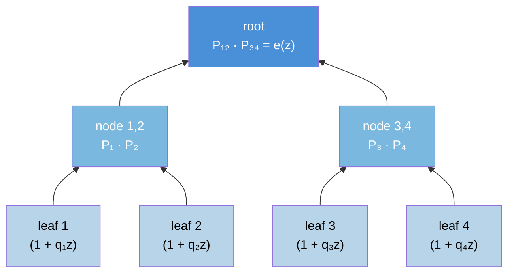
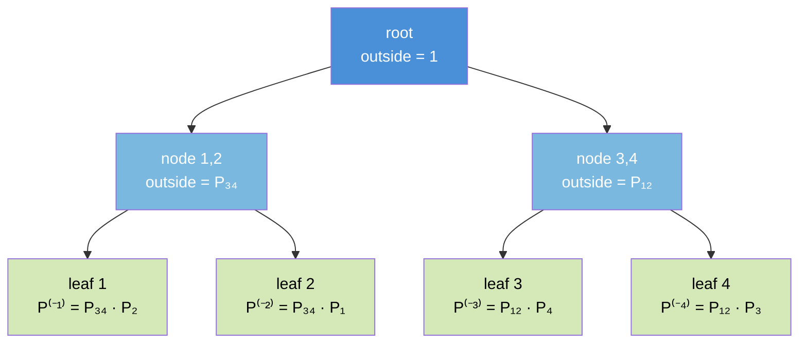
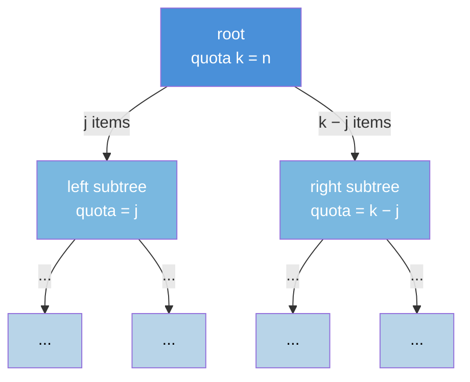

# Conditional Poisson Sampling

A NumPy implementation of the **conditional Poisson distribution** over fixed-size subsets:

$$P(S; \theta) = \frac{\exp \bigl(\sum_{i \in S} \theta_i\bigr)}{e_n(\exp \theta)}, \quad |S| = n$$

where $e_n$ is the $n$-th elementary symmetric polynomial.

## Installation

Single-file library — copy `conditional_poisson.py` into your project, or install from a local clone:

```bash
pip install .
```

Requires Python 3.8+ and NumPy.

## Usage

```python
import numpy as np
from conditional_poisson import ConditionalPoisson

# From weights
q = np.array([1.0, 2.0, 3.0, 0.5, 1.5])
cp = ConditionalPoisson.from_weights(n=2, q=q)

# Inclusion probabilities
print(cp.pi)          # shape (5,), sums to n=2

# Log-normalizer
print(cp.log_normalizer)

# Sample 1000 subsets of size 2
samples = cp.sample(1000, rng=42)   # shape (1000, 2)

# Log-probability of a subset
print(cp.log_prob([0, 3]))

# Hessian-vector product: Cov[Z] v
v = np.random.randn(5)
print(cp.hvp(v))
```

### Constructors

| Constructor | Description |
|---|---|
| `ConditionalPoisson(n, theta)` | Direct from log-weights $\theta$ |
| `ConditionalPoisson.uniform(N, n)` | Uniform inclusion probabilities $n/N$ |
| `ConditionalPoisson.from_weights(n, q)` | From positive weights $q_i = \exp(\theta_i)$ |
| `ConditionalPoisson.fit(pi_star, n)` | Fit $\theta$ to target inclusion probabilities |

### Fitting to target probabilities

```python
pi_star = np.array([0.6, 0.4, 0.8, 0.3, 0.9])  # must sum to n
cp = ConditionalPoisson.fit(pi_star, n=3, tol=1e-10, verbose=True)
print(np.max(np.abs(cp.pi - pi_star)))  # should be < tol
```

## Algorithm

All operations are built on a single **augmented polynomial product tree** over the factors $(1 + q_i z)$.

- **Upward pass** builds the P-tree: $P_T(z) = \prod_{i \in T}(1 + q_i z)$ truncated to degree $n$.
- **D-tree** (for HVP): $D_T(z) = \sum_{i \in T} q_i v_i \prod_{j \in T, j \neq i}(1 + q_j z)$, using the product rule.
- **Downward pass** propagates leave-one-out polynomials $P^{(-i)}(z)$ and $D^{(-i)}(z)$ to each leaf.
- **Sampling** walks the P-tree top-down, splitting a quota $k$ at each node proportional to $P_L[j] \cdot P_R[k-j]$.

### Upward pass (P-tree)

The P-tree computes the product polynomial $P_T(z) = \prod_{i \in T}(1 + q_i z)$ bottom-up. Each leaf holds a degree-1 factor, and internal nodes multiply their children's polynomials:



The root polynomial's $n$-th coefficient is the elementary symmetric polynomial $e_n(q)$, which is the normalizing constant.

### Downward pass (leave-one-out)

The downward pass propagates "outside" polynomials top-down. At each node, the child receives the product of its parent's outside polynomial with its sibling's inside polynomial. At the leaves, this yields the leave-one-out products $P^{(-i)}(z) = \prod_{j \neq i}(1 + q_j z)$:



The inclusion probability is then $\pi_i = q_i \cdot [z^{n-1}] P^{(-i)}(z) / e_n(q)$.

### Sampling (top-down split)

Sampling walks the P-tree top-down with a quota $k$ (initially $n$). At each internal node, the quota is split between the left and right children proportional to their polynomial coefficients:



At each split: $P(j \text{ from left} \mid k) \propto P_L[j] \cdot P_R[k-j]$. Leaves with quota 1 are included in the sample; quota 0 are excluded.

### Numerical stability

Every polynomial is stored as a **ScaledPoly** `(coeffs_norm, log_scale)` with $\max \lvert c_k \rvert = 1$. FFT convolutions operate on $O(1)$-magnitude numbers, preventing float64 overflow and FFT rounding blowup. Weights are geometrically normalised before each tree build: $q \to q / \exp(\bar{\mu})$ where $\bar{\mu} = \text{mean}(\log q)$.

### Complexity

| Operation | Time |
|---|---|
| `pi` / `log_normalizer` | $O(N \log^2 n)$ (cached) |
| `hvp(v)` | $O(N \log^2 n)$ (P-tree cached; D-tree rebuilt) |
| `sample(M)` | $O(N \log^2 n + M n \log N)$ |
| `fit(pi_star)` | $O(N \log^2 n \cdot T_{\text{Newton}} \cdot T_{\text{CG}})$ |

## Tests

```bash
pytest                              # with pytest
python test_conditional_poisson.py  # standalone
```

The test suite includes brute-force equivalence tests that verify `pi`, `log_normalizer`, `log_prob`, `hvp`, and sampling against explicit enumeration over all $\binom{N}{n}$ subsets.

## References

- Chen, Dempster & Liu (1994). "Weighted Finite Population Sampling to Maximize Entropy." *Biometrika*, 81(3), 457–469. — Introduces conditional Poisson sampling and the connection to elementary symmetric polynomials.

- Vieira (2014). ["Subsets and Superset Sampling."](https://timvieira.github.io/blog/post/2014/08/01/gumbel-max-trick-and-weighted-reservoir-sampling/) — Blog post describing divide-and-conquer sampling on product trees.

## License

MIT
