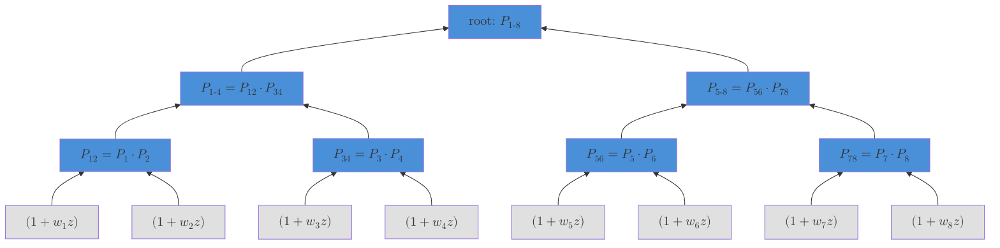
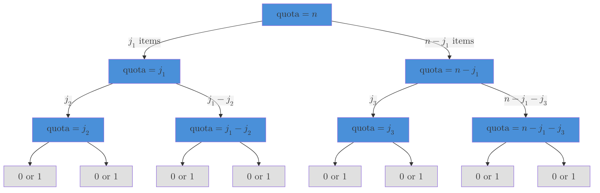

title: Conditional Poisson Sampling
date: 2026-03-25
comments: true
tags: notebook, sampling, algorithms, sampling-without-replacement

$$
\newcommand{\w}{w}
\newcommand{\bw}{\boldsymbol{w}}
\newcommand{\W}{W}
\newcommand{\Z}{Z}
\newcommand{\Zw}[2]{\binom{#1}{#2}}
\newcommand{\pip}{\pi}
\def\btheta{{\boldsymbol{\theta}}}
\def\bpip{\boldsymbol{\pi}}
\newcommand{\ba}{\boldsymbol{a}}
\newcommand{\bb}{\boldsymbol{b}}
\newcommand{\z}{z}
\newcommand{\llbracket}{[\![}
\newcommand{\rrbracket}{]\!]}
\newcommand{\defeq}{\overset{\small\text{def}}{=}}
$$

<div class="margin-note">
<a href="test_identities.py" class="verified" target="_blank">✓</a> = numerically verified—each links to its test case in <a href="test_identities.py" style="color:#999">test_identities.py</a>.
</div>

Suppose you want to draw a random subset of exactly $n$ items from a universe of $N$ items, where each item $i$ has a positive weight $\w_i$.  The **conditional Poisson distribution** assigns each size-$n$ subset a probability proportional to the product of its weights:<a href="test_identities.py#test_distribution_definition" title="test_distribution_definition, test_Z_is_elementary_symmetric_poly" class="verified" target="_blank">✓</a>

$$
P(S) \propto \prod_{i \in S} \w_i, \quad |S| = n
$$

The normalizing constant $\Zw{\bw}{n} \defeq \sum_{|S|=n} \prod_{i \in S} \w_i$ is a weighted generalization of the binomial coefficient, which recovers $\binom{N}{n} = \Zw{\bw}{n}$ when $\bw = \mathbf{1}^N$.<a href="test_identities.py#test_Z_equals_binomial_when_uniform" title="test_Z_equals_binomial_when_uniform" class="verified" target="_blank">✓</a>

**Where does the name come from?** The name comes from *Poisson sampling* (named after mathematician [Siméon Denis Poisson](https://en.wikipedia.org/wiki/Sim%C3%A9on_Denis_Poisson)—the French word for fish, but no fishing metaphor is intended).  In Poisson sampling, each item $i$ is included independently with probability $p_i$, so the sample size $|S| = \sum_i \mathbf{1}[i \in S]$ is random.  The *conditional* Poisson distribution conditions on $|S| = n$ exactly—fixing the sample size while preserving the relative inclusion odds.  Under Poisson sampling, each item's inclusion probability is simply $\pip_i = p_i$; conditioning on $|S| = n$ makes $\pip_i$ depend on all the other weights too, which is what makes computing $\bpip$ nontrivial.

**Weights are odds.** The weight $\w_i$ is the *odds* of the $i$<sup>th</sup> coin: $\w_i \defeq p_i / (1 - p_i)$, equivalently $p_i = \w_i/(1+\w_i)$.<a href="test_identities.py#test_weight_is_odds" title="test_weight_is_odds, test_conditional_poisson_from_bernoulli" class="verified" target="_blank">✓</a>  (The [identities section](#Parameterizations) compares the odds and probability parameterizations.)

**Inclusion probabilities.** The inclusion probability $\pip_i$ is the $P(S)$-weighted column sum of the $i$<sup>th</sup> indicator: $\pip_i \defeq \sum_{S} P(S)\, \mathbf{1}[i \in S]$.  Higher weight means higher inclusion probability, but the relationship is nonlinear because the other weights also matter—doubling $\w_i$ does not double $\pip_i$ (the other items "push back" through the size constraint $|S| = n$).

**Why is this distribution special?** The conditional Poisson distribution is an exponential family with natural parameters $\theta_i \defeq \log \w_i$ and sufficient statistics $\mathbf{1}[i \in S]$.  Among all distributions over size-$n$ subsets with prescribed inclusion probabilities $\pip_i = P(i \in S)$, it is the unique *maximum-entropy* one<a href="test_identities.py#test_max_entropy" title="test_max_entropy" class="verified" target="_blank">✓</a>—making the fewest assumptions beyond the marginals ([Jaynes, 1957](https://doi.org/10.1103/PhysRev.106.620); [Chen, Dempster & Liu, 1994](https://academic.oup.com/biomet/article-abstract/81/3/457/256956)), in the same sense that the Gaussian is max-entropy for given mean and variance.  The log-normalizer $\log \Zw{\bw}{n}$ is convex in $\btheta$, so many properties follow mechanically: inclusion probabilities are the gradient ($\pip_i = \partial \log \Z / \partial \theta_i$) and fitting $\btheta$ to target inclusion probabilities is a convex optimization problem.  The distribution is also called the *exponential fixed-size design* for this reason.

**What this post covers.** The computational challenges are: computing $\Zw{\bw}{n}$ and $P(S)$, computing $\bpip$ from $\bw$, drawing exact samples $S \sim P$, and the inverse problem of finding $\bw$ from target $\bpip$.  This post gives efficient algorithms for all four—in $\mathcal{O}(N \log^2 n)$ time using a polynomial product tree.  The code is available as a [Python library](https://github.com/timvieira/conditional-poisson-sampling).

**As far as I can tell, this is the only publicly available library for conditional Poisson sampling in Python** (or any language outside of R's survey-sampling packages).  Existing R implementations—`UPmaxentropy` in the [sampling](https://cran.r-project.org/web/packages/sampling/) package and the [BalancedSampling](https://cran.r-project.org/web/packages/BalancedSampling/) package—use either rejection sampling or $\mathcal{O}(Nn)$ dynamic programming.  The product-tree algorithm used here does not appear in any prior software that I'm aware of.


<style>
#cps table { border-collapse: collapse; width: auto; margin: 0; }
#cps th, #cps td { padding: 1px 2px; font-family: inherit; font-size: 0.85em; line-height: 1.3; }
#cps th { border: none; font-weight: normal; color: #666; }
#cps td { border: none; }
#cps table { border: none; margin-bottom: 0.3em; }
#cps .rl { text-align: left; color: #999; font-size: 0.75em; }
#cps .ic { text-align: center; }
#cps .pc { text-align: right; }
#cps .zero { color: #ccc; }
#cps .bar-td {
  vertical-align: bottom; text-align: center; padding: 2px 1px;
  cursor: ns-resize; user-select: none; -webkit-user-select: none;
  touch-action: none;
}
#cps .bar-td.readonly { cursor: default; }
#cps .bar-td svg { display: block; margin: 0 auto; }
@media (max-width: 600px) {
  body { font-size: 14pt; padding: 0 0.5em; }
  #cps .rl { width: 60px; font-size: 0.75em; }
  #cps th, #cps td { padding: 1px 2px; }
}

</style>

<div style="background: linear-gradient(135deg, #f8f9fa 0%, #e9ecef 100%); border: 1px solid #e0e0e0; border-radius: 8px; padding: 16px 20px; margin: 16px 0;">

**Interactive explorer.** Drag the weight bars to see how changing $w_i$ affects the subset probabilities $P(S)$ and inclusion probabilities $\pi_i$. Drag the $\pi_i$ bars to solve the inverse problem: find weights that produce given inclusion probabilities. Use the $N$ and $n$ controls to change the problem size.

<div id="cps"></div>
<script src="https://d3js.org/d3.v7.min.js"></script>
<script>
(function() {
  var N=5, n=3, w=[0.124,0.265,0.066,0.372,0.174], pi=[];
  function normW(){var s=w.reduce(function(a,b){return a+b;},0);w=w.map(function(v){return v/s;});}
  normW();
  var CW='#5b9bd5', CP='#c0504d';
  // Responsive bar sizing
  var mobile = window.innerWidth < 600;
  var barH = mobile ? 70 : 90;
  var bw = mobile ? 22 : 28;

  function subs(N,n){var r=[];(function go(s,c){if(c.length===n){r.push(c.slice());return;}if(s>=N)return;c.push(s);go(s+1,c);c.pop();go(s+1,c);})(0,[]);return r;}
  function getPi(w){
    var S=subs(N,n);
    var pr=S.map(function(s){return s.reduce(function(a,i){return a*w[i];},1);});
    var Z=pr.reduce(function(a,b){return a+b;},0);
    var p=Array(N).fill(0);
    if(Z>0) S.forEach(function(s,j){s.forEach(function(i){p[i]+=pr[j]/Z;});});
    return p;
  }
  function getTable(w){
    var S=subs(N,n);
    var pr=S.map(function(s){return s.reduce(function(a,i){return a*w[i];},1);});
    var Z=pr.reduce(function(a,b){return a+b;},0);
    return S.map(function(s,j){return{s:s,ind:Array.from({length:N},function(_,i){return s.indexOf(i)>=0?1:0;}),p:Z>0?pr[j]/Z:0};});
  }
  // Warm-start from current w, center θ to stabilize scale
  function fit(ps){
    var th=w.map(function(wi){return Math.log(Math.max(1e-10,wi));});
    for(var i=0;i<200;i++){
      var ww=th.map(function(t){return Math.exp(t);}),c=getPi(ww);
      var e=Math.max.apply(null,c.map(function(p,i){return Math.abs(p-ps[i]);}));
      if(e<1e-8)break;
      var g=c.map(function(p,i){return p-ps[i];}),s=1;
      for(var l=0;l<30;l++){
        var tn=th.map(function(t,i){return t-s*g[i];}),wn=tn.map(function(t){return Math.exp(t);});
        if(Math.max.apply(null,getPi(wn).map(function(p,i){return Math.abs(p-ps[i]);}))<e){th=tn;break;}
        s*=0.5;
      }
    }
    // Normalize w to sum to 1 (scale-invariant, keeps values in [0,1])
    var ww = th.map(function(t){return Math.exp(t);});
    var s = ww.reduce(function(a,b){return a+b;},0);
    return ww.map(function(v){return v/s;});
  }

  function getMaxW(){ return 1; }

  var root=d3.select('#cps');
  var wSvgs=[], wFills=[], wLabels=[];
  var pSvgs=[], pFills=[], pLabels=[];
  var probCells=[];

  function makeBar(td, val, maxVal, color, draggable, onDrag) {
    var svg = td.append('svg').attr('width',bw).attr('height',barH);
    svg.append('rect').attr('x',0).attr('y',0).attr('width',bw).attr('height',barH)
      .attr('fill','#f8f8f8').attr('stroke','#eee').attr('rx',2);
    var frac = Math.min(val/maxVal, 1);
    var fill = svg.append('rect').attr('x',1).attr('width',bw-2).attr('rx',2)
      .attr('y',barH-frac*barH).attr('height',frac*barH)
      .attr('fill',color).attr('opacity',0.7).style('pointer-events','none');
    var label = svg.append('text').attr('x',bw/2).attr('y',barH-frac*barH-4)
      .attr('text-anchor','middle').style('font-size','11px').style('fill',color).style('font-family',"'EB Garamond', serif")
      .style('pointer-events','none').text(val === 0 ? '0' : val < 0.01 ? '\u22480' : val.toFixed(3));
    if (draggable) {
      svg.append('rect').attr('width',bw).attr('height',barH)
        .attr('fill','transparent').attr('cursor','ns-resize')
        .style('touch-action','none')
        .call(d3.drag().on('drag',function(event){
          var frac = (barH - event.y) / barH;
          onDrag(Math.max(0, Math.min(1, frac)));
        }));
    }
    return {fill:fill, label:label};
  }

  function build() {
    root.selectAll('*').remove();
    wSvgs=[]; wFills=[]; wLabels=[];
    pSvgs=[]; pFills=[]; pLabels=[];
    probCells=[];
    pi = getPi(w);

    // Controls
    var ctrl = root.append('div').style('font-size','0.9em').style('margin-bottom','8px').style('font-family','inherit');
    ctrl.append('span').html('$N$ = ');
    ctrl.append('input').attr('type','number').attr('min',2).attr('max',8).attr('value',N)
      .style('width','44px').style('font-family','inherit').style('font-size','inherit')
      .style('border','1px solid #ccc').style('border-radius','3px').style('padding','2px 4px')
      .on('change input',function(){var v=+this.value;if(isNaN(v))return;if(v<2||v>8){d3.select('#cps-status').text('the distribution requires 2 \u2264 N \u2264 8').style('color','#c00');return;}v=Math.round(v);if(v===N)return;N=v;n=Math.min(n,N);while(w.length<N)w.push(0.5+Math.random());w=w.slice(0,N);normW();build();});
    ctrl.append('span').html('&ensp;$n$ = ');
    ctrl.append('input').attr('type','number').attr('min',0).attr('max',N).attr('value',n)
      .style('width','44px').style('font-family','inherit').style('font-size','inherit')
      .style('border','1px solid #ccc').style('border-radius','3px').style('padding','2px 4px')
      .on('change input',function(){var v=+this.value;if(isNaN(v))return;if(v<0||v>N){d3.select('#cps-status').text('the distribution requires 0 \u2264 n \u2264 N='+N).style('color','#c00');return;}v=Math.round(v);if(v===n)return;n=v;build();});

    // === ONE TABLE for everything ===
    var tbl = root.append('table');
    var cg = tbl.append('colgroup');
    cg.append('col').style('width', 'auto');
    for (var j=0;j<N;j++) cg.append('col').style('width', (bw+8)+'px');
    cg.append('col').style('width', '55px');
    var tbody = tbl.append('tbody');

    // --- Weights header ---
    var wh = tbody.append('tr');
    wh.append('td').attr('class','rl').text('weights');
    for(var i=0;i<N;i++) wh.append('td').attr('class','ic').style('color',CW).html('$w_'+(i+1)+'$');
    wh.append('td').attr('class','pc');

    // --- Weight bars ---
    var wb = tbody.append('tr');
    wb.append('td').attr('class','rl').style('font-size','0.7em').style('color','#999').html('drag to adjust<br>($\\sum w_i = 1$)');
    for(var i=0;i<N;i++){
      (function(idx){
        var td = wb.append('td').attr('class','bar-td');
        var b = makeBar(td, w[idx], getMaxW(), CW, true, function(frac){
          var target = Math.max(0, Math.min(0.99, frac));
          var EPS = 0.005;
          var wouldBeNonzero = 0;
          for(var k=0;k<N;k++) {
            if(k===idx) { if(target>EPS) wouldBeNonzero++; }
            else { if(w[k]>EPS) wouldBeNonzero++; }
          }
          if(wouldBeNonzero < n) {
            d3.select('#cps-status')
              .text('the distribution requires at least n='+n+' items with positive weight')
              .style('color','#c00');
            return;
          }
          d3.select('#cps-status').text('');
          var others = 0;
          for(var k=0;k<N;k++) if(k!==idx) others+=w[k];
          var remain = 1 - target;
          if(others > 1e-20 && remain > 0) {
            var scale = remain / others;
            for(var k=0;k<N;k++){
              if(k===idx) w[k]=target;
              else w[k]*=scale;
            }
          } else {
            w[idx] = target;
          }
          normW();
          pi = getPi(w);
          update();
        });
        wFills.push(b.fill); wLabels.push(b.label);
      })(i);
    }
    wb.append('td').attr('class','pc');

    // --- Spacer ---
    tbody.append('tr').append('td').attr('colspan',N+2).style('height','6px');

    // --- Subsets header ---
    var allS = subs(N,n);
    probCells = [];
    if (allS.length <= 70) {
      var tdata = getTable(w);
      var sh = tbody.append('tr');
      sh.append('td').attr('class','rl').style('text-align','right').html('Subset $S$');
      for(var j=0;j<N;j++) sh.append('td').attr('class','ic').text(j+1);
      sh.append('td').attr('class','pc').style('text-align','left').html('$P(S)$');

      // --- Subset rows ---
      tdata.forEach(function(r){
        var tr = tbody.append('tr');
        tr.append('td').attr('class','rl').style('color','#333').style('font-style','normal').style('text-align','right').text('{'+r.s.map(function(j){return j+1;}).join(', ')+'}');
        r.ind.forEach(function(v){tr.append('td').attr('class','ic'+(v?'':' zero')).text(v);});
        var pc = tr.append('td').attr('class','pc').style('text-align','left').style('padding','1px 2px');
        var barWrap = pc.append('div').style('display','flex').style('align-items','center').style('gap','3px');
        barWrap.append('div').attr('class','prob-bar')
          .style('height','14px').style('border-radius','2px')
          .style('background',CP).style('opacity','0.7')
          .style('min-width','1px');
        barWrap.append('span').attr('class','prob-val')
          .style('font-size','0.8em').style('color',CP).style('white-space','nowrap');
        probCells.push(pc);
      });
    } else {
      tbody.append('tr').append('td').attr('colspan',N+2).style('color','#999').style('font-size','0.85em').text('('+allS.length+' subsets\u2014table hidden)');
    }

    // --- Spacer ---
    tbody.append('tr').append('td').attr('colspan',N+2).style('height','6px');

    // --- Pi header ---
    var ph = tbody.append('tr');
    ph.append('td').attr('class','rl').style('font-weight','bold').html('inclusion prob.');
    for(var i=0;i<N;i++) ph.append('td').attr('class','ic').style('color',CP).style('font-weight','bold').html('$\\pi_'+(i+1)+'$');
    ph.append('td').attr('class','pc');

    // --- Pi bars ---
    var pb = tbody.append('tr');
    pb.append('td').attr('class','rl').style('font-size','0.7em').style('color','#999').html('drag to set target<br>($\\sum \\pi_i = n$)');
    for(var i=0;i<N;i++){
      (function(idx){
        var td = pb.append('td').attr('class','bar-td');
        var b = makeBar(td, pi[idx], 1, CP, true, function(frac){
          // Set this pi as target, solve for w
          pi[idx] = Math.max(0.02, Math.min(0.98, frac));
          w = fit(pi);
          pi = getPi(w);
          update();
        });
        pFills.push(b.fill); pLabels.push(b.label);
      })(i);
    }
    pb.append('td').attr('class','pc');

    update();
    // Typeset MathJax after DOM is rebuilt
    if (window.MathJax && MathJax.typesetPromise) {
      MathJax.typesetClear();
      MathJax.typesetPromise();
    }
  }

  function update() {
    var maxW = getMaxW();
    for(var i=0;i<N;i++){
      var wFrac=Math.min(w[i]/maxW,1);
      wFills[i].attr('y',barH-wFrac*barH).attr('height',wFrac*barH);
      wLabels[i].attr('y',barH-wFrac*barH-4).text(w[i] === 0 ? '0' : w[i] < 0.01 ? '\u22480' : w[i].toFixed(3));
      var pFrac=pi[i];
      pFills[i].attr('y',barH-pFrac*barH).attr('height',pFrac*barH);
      pLabels[i].attr('y',barH-pFrac*barH-4).text(pi[i] === 0 ? '0' : pi[i] < 0.01 ? '\u22480' : pi[i].toFixed(3));
    }
    if(probCells.length>0){
      var tdata=getTable(w);
      var maxP=Math.max.apply(null,tdata.map(function(r){return r.p;}));
      tdata.forEach(function(r,i){
        if(!probCells[i])return;
        probCells[i].select('.prob-val').text(r.p.toFixed(3));
        probCells[i].select('.prob-bar').style('width', Math.max(1, r.p/maxP*60)+'px');
      });
    }
  }

  build();
})();
</script>

</div>

## A Rejection Sampler

Here is a simple rejection sampler that produces exactly the conditional Poisson distribution.  It gives useful intuition for what the distribution *is*.

Draw $n$ items i.i.d. from the categorical distribution with probabilities $\propto \w_i$ (with replacement).  Reject unless all $n$ draws are distinct.  The resulting distribution over size-$n$ subsets satisfies $P(S) \propto \prod_{i \in S} \w_i$.<a href="test_identities.py#test_rejection_bernoulli_produces_cps" title="test_rejection_bernoulli_produces_cps" class="verified" target="_blank">✓</a>  The extra factors ($n!$ and $\W^n$, where $\W \defeq \sum_i \w_i$) are constant across all size-$n$ subsets and cancel upon conditioning.

> **Bernoulli equivalence.**  The same distribution arises from flipping $N$ independent, nonidentical coins—coin $i$ has heads probability $p_i \defeq \w_i/(1+\w_i)$—and conditioning on exactly $n$ heads.  In this view, $\w_i = p_i/(1-p_i)$ is literally the *odds* of coin $i$.  This is *Poisson sampling* conditioned on sample size, hence the name.  (The [parameterizations table](#Parameterizations) gives the precise relationship between the odds and probability generating functions.)

```
Draw n items i.i.d. from Categorical(w / sum(w)), with replacement
If all n draws are distinct, return the set; otherwise retry
```


The acceptance rate is $n! \cdot \Zw{\bw}{n} / \W^n$<a href="test_identities.py#test_categorical_acceptance_rate" title="test_categorical_acceptance_rate" class="verified" target="_blank">✓</a>, which can be very small when $n$ is not much smaller than $N$.  This sampler works well when $n \ll N$ but becomes impractical otherwise.

**The gap.** The rejection sampler doesn't give you a way to compute $\Zw{\bw}{n}$, the inclusion probabilities, or gradients for fitting—that's the gap the product tree fills.


## The Polynomial Product Tree

The key idea is to encode the sum over all $\binom{N}{n}$ subsets as the coefficient of $\z^n$ in a product of polynomials:

$$
(1 + \w_1 \z)(1 + \w_2 \z) \cdots (1 + \w_N \z) = \sum_{k=0}^{N} \Zw{\bw}{k}\, \z^k
$$

The $n$<sup>th</sup> coefficient is exactly $\Zw{\bw}{n}$, the normalizing constant.<a href="test_identities.py#test_product_polynomial_coefficients" title="test_product_polynomial_coefficients" class="verified" target="_blank">✓</a>  This product can be computed in $\mathcal{O}(N \log^2 n)$ time using a divide-and-conquer strategy on a binary tree—a standard technique from computer algebra known as the *subproduct tree* (see [von zur Gathen & Gerhard (2013)](https://doi.org/10.1017/CBO9781139856065), Chapter 10).

**Polynomials as arrays.** Each polynomial is stored as an array of coefficients: `[1, 3, 2]` represents $1 + 3\z + 2\z^2$.  Multiplying two polynomials is *convolution* of their coefficient arrays—for example, $(1 + 2\z)(1 + 3\z)$ corresponds to convolving `[1, 2]` with `[1, 3]` to get `[1, 5, 6]`.  Using the fast Fourier transform (FFT), this convolution costs $\mathcal{O}(d \log d)$ where $d$ is the degree, rather than $\mathcal{O}(d^2)$ for the schoolbook method.  This is the key fact that makes the product tree $\mathcal{O}(N \log^2 n)$ instead of $\mathcal{O}(Nn)$.

**Notation.** We write $\llbracket f \rrbracket(\z^k)$ for the coefficient of $\z^k$ in a formal power series $f(\z) = \sum_k a_k \z^k$, i.e., $\llbracket f \rrbracket(\z^k) = a_k$.  This is sometimes written $[\z^k]\, f(\z)$; we use the Scott bracket notation to avoid ambiguity with other uses of square brackets.

### Computing the Normalizing Constant $\Z$

Each leaf of a complete binary tree holds one degree-1 polynomial $(1 + \w_i \z)$.  Internal nodes multiply their children's polynomials.  The root holds the full product, whose $n$<sup>th</sup> coefficient is $\Zw{\bw}{n}$.

For example, with $N = 8$ items, the tree has three levels of internal nodes.  At the first level, pairs of leaves are multiplied: $P_{12}(\z) = (1 + \w_1 \z)(1 + \w_2 \z)$, and so on.  At the next level, $P_{1234} = P_{12} \cdot P_{34}$.  The root is $P_{12345678} = P_{1234} \cdot P_{5678}$.



<style>
#content { overflow: visible !important; }
svg text { font-family: 'EB Garamond', serif; }
#tw-controls {
  display: flex; align-items: center; gap: 12px;
  margin-bottom: 8px; font-size: 0.9em;
}
#tw-controls input[type=number] {
  width: 44px; padding: 2px 4px;
  font-family: inherit; font-size: inherit;
  border: 1px solid #ccc; border-radius: 3px;
}
#tw-status { font-size: 0.75em; color: #999; margin-top: 4px; }
</style>

<div style="background: linear-gradient(135deg, #f8f9fa 0%, #e9ecef 100%); border: 1px solid #e0e0e0; border-radius: 8px; padding: 16px 20px; margin: 16px 0; width: fit-content; min-width: 100%; max-width: none;">

**Interactive product tree.** Drag the weight sliders to see how changing $w_i$ affects the polynomial coefficients at every node. The tree builds the product $\prod_i(1 + w_i z)$ bottom-up; the $n$<sup>th</sup> coefficient at the root (highlighted in red) is the normalizing constant $Z$. Use the $N$ and $n$ controls to change the problem size.

<div id="tw"></div>
<script src="https://d3js.org/d3.v7.min.js"></script>
<script>
(function() {
  var N = 4, n = 2;
  var w = [0.2, 0.35, 0.15, 0.3];
  function normW() { var s=w.reduce(function(a,b){return a+b;},0); w=w.map(function(v){return v/s;}); }
  normW();

  var CW = '#5b9bd5', CR = '#c0504d', CI = '#d4a24e'; // blue, red, input gold
  var root = d3.select('#tw');

  function polyMul(a, b) {
    var out = new Array(a.length + b.length - 1).fill(0);
    for (var i = 0; i < a.length; i++)
      for (var j = 0; j < b.length; j++)
        out[i+j] += a[i] * b[j];
    return out;
  }

  function buildTree(w, n) {
    var leaves = w.map(function(wi, i) {
      return { poly: [1, wi], items: [i], leaf: true };
    });
    var size = 1;
    while (size < leaves.length) size *= 2;
    while (leaves.length < size)
      leaves.push({ poly: [1], items: [], leaf: true, pad: true });
    var level = leaves;
    var allLevels = [level];
    while (level.length > 1) {
      var next = [];
      for (var i = 0; i < level.length; i += 2) {
        var l = level[i], r = level[i+1];
        var p = polyMul(l.poly, r.poly);
        if (p.length > n + 1) p = p.slice(0, n + 1);
        next.push({ left: l, right: r, poly: p, items: l.items.concat(r.items), leaf: false });
      }
      level = next;
      allLevels.push(level);
    }
    return { root: level[0], levels: allLevels };
  }

  // Each histogram bar width
  // Bar dimensions — same as cps-widget sliders
  var mobile = window.innerWidth < 600;
  var bW = mobile ? 22 : 28;  // bar width (same as slider)
  var bH = mobile ? 50 : 70;  // bar height (same as slider)
  var sliderH = bH;            // sliders are the same size
  var bGap = 4;                // gap between bars within a node
  var nodePad = 12;            // padding inside group box
  var vGap = 30;
  var hGap = 20;

  var sliderFills = [], sliderLabels = [];
  var nodeRefs = [];
  var zLabelDiv = null;

  // Place MathJax labels as absolutely-positioned HTML divs over the SVG
  // svgContainer must be position:relative
  var mathLabels = [];
  function addMathLabel(container, x, y, html, opts) {
    opts = opts || {};
    var div = container.append('div')
      .style('position', 'absolute')
      .style('left', x + 'px')
      .style('top', y + 'px')
      .style('font-size', opts.fontSize || '10px')
      .style('color', opts.color || '#999')
      .style('pointer-events', 'none')
      .style('white-space', 'nowrap');
    if (opts.anchor === 'middle') {
      div.style('transform', 'translateX(-50%)');
    } else if (opts.anchor === 'end') {
      div.style('transform', 'translateX(-100%)');
    }
    div.html(html);
    mathLabels.push(div);
    return div;
  }

  var dur = 400;
  var animating = false;
  var lastAction = null; // 'add' or 'remove' or null

  function changeN(target) {
    if (animating || target === N) return;
    if (target < 2) return;
    animating = true;

    function step() {
      if (N === target) { animating = false; return; }
      if (target > N) {
        w.push(0);
        N = N + 1;
        lastAction = 'add';
      } else {
        var removed = w.pop();
        N = N - 1;
        var s = w.reduce(function(a,b){return a+b;}, 0);
        if (s > 0) w = w.map(function(v) { return v / s; });
        lastAction = 'remove';
      }
      n = Math.min(n, N);
      normW();
      buildInner();
      if (N !== target) {
        setTimeout(step, dur);
      } else {
        animating = false;
      }
    }
    step();
  }

  function build() {
    buildInner();
  }

  function buildInner() {
    root.selectAll('*').remove();
    sliderFills = []; sliderLabels = [];
    nodeRefs = [];
    mathLabels = [];

    // Controls
    var ctrl = root.append('div').attr('id', 'tw-controls');
    ctrl.append('span').html('$N$ = ');
    ctrl.append('input').attr('type','number').attr('min',2).attr('value',N)
      .on('change input', function() {
        var v = Math.max(2, Math.round(+this.value));
        if (v === N) return;
        changeN(v);
      });
    ctrl.append('span').html('&ensp;$n$ = ');
    ctrl.append('input').attr('type','number').attr('min',0).attr('max',N).attr('value',n)
      .on('change input', function() {
        var v = Math.max(0, Math.min(N, Math.round(+this.value)));
        if (v === n) return;
        n = v; build();
      });

    var tree = buildTree(w, n);
    var levels = tree.levels;
    var depth = levels.length;

    // Layout: leaves at top, root at bottom
    // Compute each node's box width
    function nodeBoxW(nd) {
      if (nd.pad) return 0;
      var nc = Math.min(nd.poly.length, n + 1);
      return nc * (bW + bGap) - bGap + nodePad;
    }

    var levelSpacings = levels.map(function(lev) {
      var maxW = 0;
      lev.forEach(function(nd) { var w = nodeBoxW(nd); if (w > maxW) maxW = w; });
      return maxW + hGap;
    });
    levelSpacings[0] = Math.max(levelSpacings[0], bW + hGap + 10);

    // Find the widest level to set SVG width
    var maxLevelW = 0;
    for (var li = 0; li < levels.length; li++) {
      var lw = levels[li].length * levelSpacings[li];
      if (lw > maxLevelW) maxLevelW = lw;
    }
    var leafCount = levels[0].length;
    var svgW = Math.max(300, leafCount * levelSpacings[0] + 60);

    var labelH = 16;
    var topPad = 10;
    var sepGap = 20;       // space around separator lines
    var arrowLen = 14;     // connector arrows between zones
    var nodeH = bH + nodePad;

    // Zone 1: inputs (labels + sliders)
    var inputZoneTop = topPad;
    var inputZoneBot = topPad + labelH + sliderH + 4;
    // Separator 1
    var sep1Y = inputZoneBot + sepGap/2;
    // Zone 2: circuit (tree nodes)
    var leafY = sep1Y + sepGap/2 + arrowLen;
    var rootBot = leafY + (depth - 1) * (nodeH + vGap) + nodeH;
    // Separator 2
    var sep2Y = rootBot + sepGap;
    // Zone 3: output (Z label)
    var outputY = sep2Y + sepGap/2 + arrowLen;
    var svgH = outputY + 18;

    root.style('width', svgW + 'px');
    var svgWrap = root.append('div')
      .style('position', 'relative')
      .style('width', svgW + 'px')
      .style('height', svgH + 'px');
    var svg = svgWrap.append('svg')
      .attr('width', svgW).attr('height', svgH)
      .style('display', 'block').style('user-select', 'none');

    // Assign x: leaves left-aligned, so adding on the right doesn't shift the left
    var leafSpacing = levelSpacings[0];
    var leafStartX = 20;
    for (var ni = 0; ni < leafCount; ni++) {
      levels[0][ni].x = leafStartX + ni * leafSpacing + leafSpacing / 2;
      levels[0][ni].y = leafY;
    }
    // Internal levels: x = midpoint of children
    for (var li = 1; li < levels.length; li++) {
      levels[li].forEach(function(nd) {
        if (nd.left && nd.right) {
          nd.x = (nd.left.x + nd.right.x) / 2;
        } else if (nd.left) {
          nd.x = nd.left.x;
        }
        nd.y = leafY + li * (nodeH + vGap);
      });
    }

    // --- Zone separators and connectors ---
    // Separator 1: inputs → circuit
    svg.append('line').attr('x1', 10).attr('x2', svgW - 10)
      .attr('y1', sep1Y).attr('y2', sep1Y)
      .attr('stroke', '#e0e0e0').attr('stroke-width', 1).attr('stroke-dasharray', '4,4');

    // Arrow markers
    var arrowDef = svg.append('defs');
    // Arrowhead pointing along line direction (right-pointing triangle, orient=auto rotates it)
    arrowDef.append('marker').attr('id','arrowDown').attr('viewBox','0 0 10 10')
      .attr('refX',10).attr('refY',5)
      .attr('markerWidth',7).attr('markerHeight',7).attr('orient','auto')
      .append('path').attr('d','M0,0 L10,5 L0,10 Z').attr('fill','#ccc');

    // Connector lines drawn after nodes (need _barXs), see below

    // Separator 2: circuit → output
    svg.append('line').attr('x1', 10).attr('x2', svgW - 10)
      .attr('y1', sep2Y).attr('y2', sep2Y)
      .attr('stroke', '#e0e0e0').attr('stroke-width', 1).attr('stroke-dasharray', '4,4');

    // Arrow from root's n-th bar bottom to output zone (drawn after nodes so _barXs exists)
    arrowDef.append('marker').attr('id','arrowDownRed').attr('viewBox','0 0 10 10')
      .attr('refX',10).attr('refY',5)
      .attr('markerWidth',8).attr('markerHeight',8).attr('orient','auto')
      .append('path').attr('d','M0,0 L10,5 L0,10 Z').attr('fill', CR);
    // (actual line drawn after nodes, see below)

    // --- Draw edges ---
    for (var li = 1; li < levels.length; li++) {
      levels[li].forEach(function(nd) {
        [nd.left, nd.right].forEach(function(child) {
          if (!child || child.pad) return;
          var x1 = child.x, y1 = child.y + bH + nodePad;
          var x2 = nd.x, y2 = nd.y;
          var my = (y1 + y2) / 2;
          // Only tag edge if the child is the new leaf
          var edgeNew = lastAction === 'add' && child.leaf && child.items && child.items.indexOf(N-1) >= 0;
          svg.append('path')
            .attr('d', 'M'+x1+','+y1+' C'+x1+','+my+' '+x2+','+my+' '+x2+','+y2)
            .attr('fill', 'none').attr('stroke', '#ddd').attr('stroke-width', 1.2)
            .classed('new-node', edgeNew);
        });
      });
    }

    // --- Draw histograms for all nodes ---
    // Find global max coefficient for consistent scaling
    var globalMax = 0;
    (function walk(nd) {
      if (!nd || nd.pad) return;
      nd.poly.forEach(function(c) { if (Math.abs(c) > globalMax) globalMax = Math.abs(c); });
      if (nd.left) walk(nd.left);
      if (nd.right) walk(nd.right);
    })(tree.root);
    if (globalMax === 0) globalMax = 1;

    for (var li = 0; li < levels.length; li++) {
      levels[li].forEach(function(nd) {
        if (nd.pad) { nodeRefs.push(null); return; }
        var coeffs = nd.poly;
        var nCoeffs = Math.min(coeffs.length, n + 1);
        var boxW = nCoeffs * (bW + bGap) - bGap + nodePad;
        var gx = nd.x - boxW/2;
        // Only the leaf itself is "new" — ancestors already existed
        var isNew = lastAction === 'add' && nd.leaf && nd.items && nd.items.indexOf(N-1) >= 0;
        var g = svg.append('g')
          .attr('transform', 'translate(' + gx + ',' + nd.y + ')')
          .classed('new-node', isNew);

        // Group box
        g.append('rect').attr('width', boxW).attr('height', bH + nodePad)
          .attr('fill', '#f9f9f9').attr('stroke', 'none').attr('rx', 5);
        // Clip to keep labels inside
        var clipId = 'clip-' + li + '-' + ni;
        svg.append('defs').append('clipPath').attr('id', clipId)
          .append('rect').attr('width', boxW + 4).attr('height', bH + nodePad + 16)
          .attr('x', -2).attr('y', -14);
        g.attr('clip-path', 'url(#' + clipId + ')');

        var cRects = [], cTexts = [];
        for (var k = 0; k < nCoeffs; k++) {
          var bx = nodePad/2 + k * (bW + bGap);
          var barFrac = Math.min(1, Math.abs(coeffs[k]) / globalMax);
          var barPx = Math.max(0.5, barFrac * bH);
          var isHighlight = (li === levels.length - 1 && k === n);
          var col = isHighlight ? CR : CW;
          var by = nodePad/2; // vertical offset inside group
          // Track (same as cps-widget slider)
          g.append('rect')
            .attr('x', bx).attr('y', by)
            .attr('width', bW).attr('height', bH)
            .attr('fill', '#f8f8f8').attr('stroke', '#eee').attr('rx', 2);
          // Fill
          var cr = g.append('rect')
            .attr('x', bx + 1).attr('width', bW - 2).attr('rx', 2)
            .attr('y', by + bH - barPx).attr('height', barPx)
            .attr('fill', col).attr('opacity', 0.7);
          cRects.push(cr);
          // Value label above fill
          var ct = g.append('text')
            .attr('x', bx + bW/2).attr('y', nodePad/2 + bH - barPx - 3)
            .attr('text-anchor', 'middle')
            .style('font-size', '9px').style('fill', col)
            .style('font-family', "'EB Garamond', serif")
            .text(fmtCoeff(coeffs[k]));
          cTexts.push(ct);
        }

        // At root: add index labels below
        if (li === levels.length - 1) {
          for (var k = 0; k < nCoeffs; k++) {
            var labelX = gx + nodePad/2 + k * (bW + bGap) + bW/2;
            addMathLabel(svgWrap, labelX, nd.y + bH + 4,
              k === n ? '$\\mathbf{' + k + '}$' : '$' + k + '$',
              {anchor:'middle', color: k === n ? CR : '#bbb', fontSize:'9px'});
          }
        }

        // Store x positions for slider alignment
        nd._barXs = [];
        for (var k = 0; k < nCoeffs; k++) {
          nd._barXs.push(gx + nodePad/2 + k * (bW + bGap));
        }

        nodeRefs.push({ cellRects: cRects, cellTexts: cTexts, nCoeffs: nCoeffs });
      });
    }

    // --- Root → output arrow (from n-th bar center) ---
    var rootNdFinal = levels[levels.length - 1][0];
    var zLabelX = rootNdFinal.x; // default
    if (rootNdFinal._barXs && n < rootNdFinal._barXs.length) {
      var rootCx = rootNdFinal._barXs[n] + bW/2;
      zLabelX = rootCx;
      // Bezier curve from red bar to Z label, with manual arrowhead
      var x1 = rootCx, y1 = rootBot + 8;
      var x2 = rootNdFinal.x, y2 = outputY;
      zLabelX = x2;
      // Control points: leave downward, arrive downward
      var cp1x = x1, cp1y = y1 + (y2-y1)*0.7;
      var cp2x = x2, cp2y = y1 + (y2-y1)*0.3;
      // Shorten the path so arrowhead doesn't overshoot
      var tipGap = 6;
      var y2s = y2 - tipGap;
      svg.append('path')
        .attr('d', 'M'+x1+','+y1+' C'+cp1x+','+cp1y+' '+cp2x+','+cp2y+' '+x2+','+y2s)
        .attr('fill', 'none').attr('stroke', '#d4a0a0').attr('stroke-width', 1.2);
      // Manual arrowhead: triangle at endpoint, oriented along tangent from cp2 to endpoint
      var dx = x2 - cp2x, dy = y2s - cp2y;
      var len = Math.sqrt(dx*dx + dy*dy);
      if (len > 0) { dx /= len; dy /= len; }
      var ax = 5; // arrowhead half-width
      var al = 8; // arrowhead length
      // Tip at (x2, y2), base perpendicular to tangent
      var bx = x2 - dx*al, by = y2 - dy*al;
      var px = -dy, py = dx; // perpendicular
      svg.append('path')
        .attr('d', 'M'+x2+','+y2+
          ' L'+(bx+px*ax)+','+(by+py*ax)+
          ' L'+(bx-px*ax)+','+(by-py*ax)+' Z')
        .attr('fill', '#d4a0a0');
    }

    // --- Connector arrows from slider bottom to leaf w_i bar top ---
    levels[0].forEach(function(nd, idx) {
      if (nd.pad || !nd._barXs) return;
      var cx = nd._barXs[1] + bW/2;
      var isNew = lastAction === 'add' && nd.items && nd.items.indexOf(N-1) >= 0 && nd.leaf;
      svg.append('line')
        .attr('x1', cx).attr('y1', inputZoneBot)
        .attr('x2', cx).attr('y2', nd.y)
        .attr('stroke', '#ccc').attr('stroke-width', 1)
        .attr('marker-end', 'url(#arrowDown)')
        .classed('new-node', isNew);
    });

    // --- Sliders above leaves, aligned to the w_i bar (index 1) ---
    levels[0].forEach(function(nd, idx) {
      if (nd.pad) return;
      (function(idx) {
        var barX = nd._barXs[1];
        var sliderTop = topPad + labelH;
        var isNew = lastAction === 'add' && idx === N - 1;
        var sg = svg.append('g').classed('new-node', isNew);

        // Track
        sg.append('rect')
          .attr('x', barX + 1).attr('y', sliderTop)
          .attr('width', bW - 2).attr('height', sliderH)
          .attr('fill', '#f8f8f8').attr('stroke', '#eee').attr('rx', 1);

        // Fill
        var frac = Math.min(w[idx], 1);
        var sf = sg.append('rect')
          .attr('x', barX + 2).attr('width', bW - 4).attr('rx', 1)
          .attr('y', sliderTop + sliderH - frac * sliderH).attr('height', frac * sliderH)
          .attr('fill', CI).attr('opacity', 0.8).style('pointer-events', 'none');
        sliderFills.push(sf);

        // Label
        var sl = sg.append('text')
          .attr('x', barX + bW/2).attr('y', sliderTop + sliderH - frac * sliderH - 2)
          .attr('text-anchor', 'middle')
          .style('font-size', '9px').style('fill', CI).style('pointer-events', 'none')
          .text(w[idx].toFixed(2));
        sliderLabels.push(sl);

        // Item label above slider (MathJax)
        var ml = addMathLabel(svgWrap, barX + bW/2, topPad, '$w_{' + (idx+1) + '}$', {anchor:'middle', color:CI, fontSize:'11px'});
        if (isNew) ml.classed('new-node', true);

        // Drag target (wider for touch)
        sg.append('rect')
          .attr('x', barX - 4).attr('y', sliderTop - 2)
          .attr('width', bW + 8).attr('height', sliderH + 4)
          .attr('fill', 'transparent').attr('cursor', 'ns-resize')
          .style('touch-action', 'none')
          .call(d3.drag().on('drag', function(event) {
            var frac = (sliderTop + sliderH - event.y) / sliderH;
            var target = Math.max(0.01, Math.min(0.99, frac));
            var others = 0;
            for (var k = 0; k < N; k++) if (k !== idx) others += w[k];
            var remain = 1 - target;
            if (others > 1e-10 && remain > 0) {
              var scale = remain / others;
              for (var k = 0; k < N; k++) {
                if (k === idx) w[k] = target;
                else w[k] = Math.max(0.001, w[k] * scale);
              }
            }
            normW();
            updateTree();
          }));
      })(idx);
    });

    // Z label in output zone, centered on the n-th bar
    zLabelDiv = addMathLabel(svgWrap, zLabelX, outputY, '', {anchor:'middle', color: CR, fontSize: '14px'});

    root.datum({ levels: levels, tree: tree, globalMax: globalMax });
    updateTree();

    // Animate new node sprouting in: fade in elements tagged 'new'
    if (lastAction === 'add') {
      svg.selectAll('.new-node')
        .style('opacity', 0)
        .transition().duration(dur)
        .style('opacity', null);
      mathLabels.forEach(function(ml) {
        if (ml.classed('new-node')) {
          ml.style('opacity', 0).transition().duration(dur).style('opacity', '1');
        }
      });
    }
    lastAction = null;

    // MathJax: typeset after fade starts
    setTimeout(function() {
      if (window.MathJax && MathJax.typesetPromise) {
        var tw = document.getElementById('tw');
        MathJax.typesetClear([tw]);
        MathJax.typesetPromise([tw]);
      }
    }, 10);
  }

  function fmtCoeff(v) {
    if (v === 0) return '0';
    if (v < 0.005 && v > 0) return '';
    if (v >= 10) return v.toFixed(0);
    if (v >= 1) return v.toFixed(1);
    return v.toFixed(2);
  }

  function updateTree() {
    var data = root.datum();
    var levels = data.levels;
    var sliderTop = 10 + 16; // topPad + labelH

    // Update sliders
    for (var i = 0; i < N; i++) {
      var frac = Math.min(w[i], 1);
      sliderFills[i].attr('y', sliderTop + sliderH - frac * sliderH).attr('height', frac * sliderH);
      sliderLabels[i].attr('y', sliderTop + sliderH - frac * sliderH - 2).text(w[i].toFixed(2));
    }

    // Rebuild tree data
    var newTree = buildTree(w, n);
    var newLevels = newTree.levels;

    // Recompute global max
    var gMax = 0;
    (function walk(nd) {
      if (!nd || nd.pad) return;
      nd.poly.forEach(function(c) { if (Math.abs(c) > gMax) gMax = Math.abs(c); });
      if (nd.left) walk(nd.left);
      if (nd.right) walk(nd.right);
    })(newTree.root);
    if (gMax === 0) gMax = 1;

    // Update histograms
    var ri = 0;
    for (var li = 0; li < newLevels.length; li++) {
      for (var ni = 0; ni < newLevels[li].length; ni++) {
        var ref = nodeRefs[ri++];
        if (!ref) continue;
        var coeffs = newLevels[li][ni].poly;
        var nCoeffs = ref.nCoeffs;
        for (var k = 0; k < nCoeffs; k++) {
          var barFrac = Math.min(1, Math.abs(coeffs[k]) / gMax);
          var barPx = Math.max(1, barFrac * bH);
          ref.cellRects[k].attr('y', nodePad/2 + bH - barPx).attr('height', barPx);
          if (ref.cellTexts[k]) {
            ref.cellTexts[k].attr('y', nodePad/2 + bH - barPx - 3).text(fmtCoeff(coeffs[k]));
          }
        }
      }
    }

    var Z = newTree.root.poly[Math.min(n, newTree.root.poly.length - 1)];
    var zNode = zLabelDiv.node();
    zNode.innerHTML = '$Z = ' + (Z !== undefined ? Z.toFixed(4) : '\\text{—}') + '$';
    if (window.MathJax && MathJax.typesetPromise) {
      MathJax.typesetClear([zNode]);
      MathJax.typesetPromise([zNode]);
    }
  }

  build();
})();
</script>

</div>


**Complexity.** At each level of the tree, the total size of the polynomials being multiplied is $\mathcal{O}(N)$, and each multiplication is done via FFT in $\mathcal{O}(d \log d)$ time where $d$ is the degree. The recurrence is

$$T(N) = 2\,T(N/2) + \mathcal{O}(N \log N)$$

which solves to $T(N) = \mathcal{O}(N \log^2 n)$ by the Master Theorem.
The complexity is $\mathcal{O}(N \log^2 n)$ rather than $\mathcal{O}(N \log^2 N)$ because we only need the coefficient at $\z^n$: intermediate polynomials can be **truncated to degree $n$** without affecting the result.  (Convolution of two polynomials truncated to degree $n$ still gives the correct coefficients up to degree $n$.)  This reduces both the polynomial sizes and the FFT costs throughout the tree.


### Computing Inclusion Probabilities $\bpip$

The inclusion probability is the gradient of the log-normalizer (an exponential family identity):

$$\pip_i \defeq \frac{\partial \log \Zw{\bw}{n}}{\partial \theta_i}$$

Since the product tree already computes $\log \Zw{\bw}{n}$, we get $\bpip$ by running [backpropagation](https://timvieira.github.io/blog/evaluating-fx-is-as-fast-as-fx/) on the same tree—no new algorithm needed.  By the Baur-Strassen theorem ([1983](https://doi.org/10.1016/0304-3975(83)90110-X)), the gradient costs at most a constant factor more than the forward computation.

**The key insight: forward + backprop.**  Computing $\pip_i$ requires the "leave-one-out" product $\prod_{j \neq i}(1 + \w_j \z)$—a single item removed from the full product.  A naive approach recomputes this from scratch for each $i$, giving $\mathcal{O}(N^2 n)$ total.  But any differentiable forward pass that computes $\log \Z$—whether the $\mathcal{O}(Nn)$ Pascal DP or the $\mathcal{O}(N \log^2 n)$ product tree—gives all $N$ inclusion probabilities via a single backpropagation pass at the same asymptotic cost.  This is a general principle: backprop computes the gradient of any scalar output for free (up to a small constant factor).  The product tree is just the fastest known forward pass; the gradient follows mechanically.

In the PyTorch implementation, the gradient comes for free via `torch.autograd`—no hand-coded tree traversal needed.


### Drawing Exact Samples

Sampling reuses the product tree (no gradient computation needed).  Starting at the root with a quota of $k = n$ items to select, we walk top-down: at each internal node, randomly split the quota between the left and right subtrees.  The probability of assigning $j$ items to the left is proportional to $\llbracket P_L \rrbracket(\z^j) \cdot \llbracket P_R \rrbracket(\z^{k-j})$.  This is exact, not approximate—it follows from the **weighted Vandermonde identity**: $\Zw{(\ba;\, \bb)}{k} = \sum_{j=0}^{k} \Zw{\ba}{j} \cdot \Zw{\bb}{k-j}$, which says the number of ways to choose $k$ items from $A \cup B$ is the convolution of the two groups' counts.  Each term in the sum is the conditional probability of a particular left/right split.  At the leaves, quota 1 means "include this item"; quota 0 means "exclude."



In pseudocode:

```python
def sample(node, quota):
    if node.is_leaf:
        return [node.item] if quota == 1 else []
    # P_L[j] * P_R[quota-j] for j = 0, ..., quota
    probs = [node.left.poly[j] * node.right.poly[quota - j]
             for j in range(quota + 1)]
    j = categorical(probs)              # how many items from the left subtree
    return sample(node.left, j) + sample(node.right, quota - j)

S = sample(root, n)                     # exactly n items
```

The tree is built once ($\mathcal{O}(N \log^2 N)$) and reused for each sample ($\mathcal{O}(n \log N)$ per sample)—at each of the $\mathcal{O}(\log N)$ levels, only nodes whose quota is nonzero are visited, and there are at most $n$ such nodes.  (When $n \approx N$, nearly all nodes are visited, so the per-sample cost approaches $\mathcal{O}(N \log N)$.)  No $\binom{N}{n}$-sized table is ever constructed.

All computations are verified against brute-force enumeration in the [test suite](test_identities.py).


## Basic Usage

Now that we've seen how the product tree works under the hood, here's the library interface.  The simplest entry point is `from_weights`: hand it a subset size $n$ and a weight vector $\bw$.



The inclusion probabilities $\pip_i = P(i \in S)$ always sum to $n$,<a href="test_identities.py#test_pi_sums_to_n" title="test_pi_sums_to_n" class="verified" target="_blank">✓</a> and each $\pip_i \in [0, 1]$.<a href="test_identities.py#test_pi_in_unit_interval" title="test_pi_in_unit_interval" class="verified" target="_blank">✓</a>  Items with larger weights get higher inclusion probabilities.



The blue curve shows the *Poisson approximation*: if each item were included independently with probability $p_i = w_i r / (1 + w_i r)$ (where $r$ is the tilting parameter that makes $\sum p_i = n$), we would get $\pip_i \approx p_i$.  The actual inclusion probabilities (dots) are close but not identical—conditioning on $|S| = n$ introduces a correction of $\mathcal{O}(1/N)$ per item ([Hájek, 1964](https://doi.org/10.1214/aoms/1177700375)).  This approximation is the warm start for [fitting](#Fitting-Weights-to-Target-Probabilities): inverting the Poisson relationship gives $\theta_i \approx \log(\pip^*_i / (1 - \pip^*_i))$, which is close enough that the optimizer converges in a few iterations.


## Drawing Samples

Drawing samples works by walking a binary tree top-down, splitting a "quota" of $n$ items between the left and right subtrees at each node.  Each split is exact (not approximate),<a href="test_identities.py#test_sampling_distribution" title="test_sampling_distribution" class="verified" target="_blank">✓</a> and the tree is built once and cached, so subsequent samples are cheap.



Let's verify that the empirical inclusion frequencies match the exact $\bpip$ values.



## Fitting Weights to Target Probabilities

A common use case: you know the inclusion probabilities you *want* and need to find weights that produce them.<a href="test_identities.py#test_fitting_recovers_target" title="test_fitting_recovers_target" class="verified" target="_blank">✓</a>

**Objective.**  The log-probability of a subset is $\log P(S) = \sum_{i \in S} \theta_i - \log \Zw{\bw}{n}$, where $\theta_i \defeq \log \w_i$.  Taking the expectation under the target marginals $\bpip^*$ gives the objective:

$$
L(\btheta) \defeq \bpip^{*\top} \btheta - \log \Zw{\bw}{n}
$$

This is concave (since $\log \Zw{\bw}{n}$ is convex as a log-partition function), guaranteeing a unique global maximum.

**Gradient.**  $\nabla_{\btheta} L(\btheta) = \bpip^* - \bpip(\btheta)$.<a href="test_identities.py#test_fitting_gradient" title="test_fitting_gradient" class="verified" target="_blank">✓</a>  At the optimum, $\bpip(\btheta) = \bpip^*$ exactly, so the gradient is zero.  Each evaluation of $L$ and $\nabla L$ costs $\mathcal{O}(N \log^2 n)$ (one pass through the product tree + backpropagation).

**Optimizer.**  L-BFGS converges in a few iterations using only the gradient—no second-order machinery needed.  The warm start $\theta_i^{(0)} = \log(\bpip^*_i / (1 - \bpip^*_i))$ has initialization error $\mathcal{O}(1/N)$ per item ([Hájek, 1964, Theorem 5.2](https://doi.org/10.1214/aoms/1177700375)), so the optimizer starts close to the solution.


<details class="derivation">
<summary><b>Warm start: why logit(π*) is a good initialization</b> (click to expand)</summary>

The optimizer is initialized at $\theta_i^{(0)} = \log(\pip^*_i / (1 - \pip^*_i))$, i.e., the log-odds of the target inclusion probabilities.  This is the exact solution in the *unconditional* Poisson case: if we flip independent coins with $p_i = \pip^*_i$, the odds are $\w_i \defeq p_i/(1-p_i)$ and the expected sample size is $\sum \pip^*_i = n$.  Conditioning on the sample size being exactly $n$ perturbs the inclusion probabilities, but the perturbation is small.

Hájek (1964, Theorem 5.2) showed that under standard regularity conditions, the conditional Poisson inclusion probabilities satisfy

$$\pip_i = p_i + \mathcal{O}(1/N)$$

where $p_i \defeq \w_i/(1+\w_i)$ are the unconditional Poisson probabilities.  [Boistard, Lopuhaä & Ruiz-Gazen (2012)](https://arxiv.org/abs/1207.5654) give the explicit correction term:

$$\pip_i = p_i\Big(1 - d^{-1}(p_i - \bar{p})(1 - p_i) + \mathcal{O}(d^{-2})\Big)$$

where $d \defeq \sum_i p_i(1-p_i)$ is the variance of the Poisson sample size and $\bar{p} \defeq d^{-1}\sum_i p_i^2(1-p_i)$.  Under the regularity condition $\limsup N/d < \infty$ (which holds whenever the $p_i$ are bounded away from 0 and 1), we have $d = \Theta(N)$, so the initialization error is $\mathcal{O}(1/N)$—essentially exact for large $N$, and a good starting point for Newton's method at any $N$.

</details>



## Timing

The tree-based approach scales to moderately large $N$ comfortably.  For comparison, the naive $\mathcal{O}(N^2 n)$ dynamic programming (DP) baseline is also shown.  (The PyTorch FFT implementation in the next section is significantly faster—see below.)



## PyTorch Implementation with Contour Scaling

The NumPy implementation above uses hand-coded tree traversals with `scipy.signal.convolve`.  A natural question: can we use PyTorch's autograd to compute the gradient (inclusion probabilities) automatically, given only the forward pass?

The answer is yes—and it's both simpler and faster.  The key insight is that **computing $\bpip$ is just backpropagation** applied to the upward pass.  The [Baur-Strassen theorem](https://timvieira.github.io/blog/evaluating-fx-is-as-fast-as-fx/) guarantees that the gradient costs at most a small constant factor more than the forward pass ([Baur & Strassen, 1983](https://doi.org/10.1016/0304-3975(83)90110-X) prove $3\times$ for nonscalar operations on polynomials; [Griewank & Walther, 2008](https://doi.org/10.1137/1.9780898717761) give $5\times$ for general reverse-mode AD).  [Griewank & Walther (2008)](https://doi.org/10.1137/1.9780898717761) show that the numerical stability of the derivatives is inherited from the forward pass—so if we make the forward pass stable, everything else follows.

The computation is just the product tree: build $\prod_i (1 + \w_i \z)$ bottom-up using polynomial multiplication, then extract $\llbracket \cdot \rrbracket(\z^n)$ and take the log.  In PyTorch, we batch all multiplications at each tree level into a single operation—$\mathcal{O}(\log N)$ torch calls instead of $\mathcal{O}(N)$.

### The FFT Precision Problem and Weight Rescaling

Using FFT for the polynomial multiplications gives $\mathcal{O}(N \log^2 n)$ complexity (with truncation to degree $n$).  But naively, FFT introduces rounding errors $\sim \varepsilon \cdot \max_k|c_k|$ per coefficient, where $c_k$ denotes the $k$<sup>th</sup> coefficient of the product polynomial $\prod_i(1 + \w_i \z) = \sum_k c_k \z^k$.  The largest coefficient (near degree $N/2$) can be $\sim 10^{300}$ times larger than $c_n$, the coefficient we need—so FFT noise drowns the signal.

**The key identity.**  For any $r > 0$:<a href="test_identities.py#test_contour_scaling" title="test_contour_scaling" class="verified" target="_blank">✓</a>

$$\Zw{\bw}{n} = r^{-n} \cdot \llbracket \textstyle\prod_i(1 + \w_i r\, \z) \rrbracket(\z^n)$$

This is immediate: each $\z^n$ term in the product picks up a factor of $r$ per item, giving $r^n \cdot \Zw{\bw}{n}$.  The identity says we can rescale all weights by any $r > 0$ and recover the same answer.  In exact arithmetic, $r$ doesn't matter.  In floating-point, it matters enormously: different values of $r$ shift which coefficient is largest, changing the dynamic range and thus the FFT rounding error relative to $c_n$.

**Choosing $r$.**  The FFT error in $c_n$ is $\mathcal{O}(\varepsilon \cdot \max_k |c_k|)$, so the relative error is $\max_k |c_k| / |c_n|$ times machine epsilon.  If $c_n$ is the largest coefficient, the relative error is just $\mathcal{O}(\varepsilon)$.  After rescaling by $r$, the $k$<sup>th</sup> coefficient becomes $c_k(r) = \Zw{\bw}{k} \cdot r^k$.  We want $r$ such that $c_n(r) \approx \max_k c_k(r)$.

Define $p_i \defeq \w_i r/(1 + \w_i r)$.  Then $c_k(r) = \prod_i(1+\w_i r) \cdot \Pr[K = k]$ where $K \defeq \sum_i \text{Bernoulli}(p_i)$ and $\prod_i(1+\w_i r)$ is independent of $k$.  So $\arg\max_k c_k(r) = \text{mode}(K)$.  For a sum of independent Bernoullis, $|\text{mode}(K) - \mathbb{E}[K]| \le 1$ ([Darroch, 1964](https://doi.org/10.1214/aoms/1177703287)).  Setting $\mathbb{E}[K] = n$ places the mode at degree $n \pm 1$:<a href="test_identities.py#test_contour_r_solves_expected_size" title="test_contour_r_solves_expected_size" class="verified" target="_blank">✓</a>

$$\sum_i \frac{\w_i \cdot r}{1 + \w_i \cdot r} = n$$

This is monotone in $\log r$ (the LHS increases from 0 to $N$), so Newton's method converges in a few iterations.  A simpler heuristic, $r = n / \W$ (where $\W \defeq \sum_i \w_i$), linearizes $\w_i r / (1 + \w_i r) \approx \w_i r$ and works for mild weights but breaks down with heavy tails.

**Guarantee.** With this choice of $r$, the coefficients $c_k(r)$ are proportional to the PMF of $K$, whose mode is at $n \pm 1$.  The PMF of a sum of Bernoullis is log-concave, so it decays exponentially away from the mode.  In practice, this makes the dynamic range $\max_k c_k / c_n$ a modest constant (typically $\approx 1$), ensuring the relative FFT error in $c_n$ is $\mathcal{O}(\varepsilon)$.


**Autograd compatibility.** The rescaling $\w_i \mapsto \w_i \cdot r$ is on the autograd graph (it's just a scalar multiply); the root-finding for $r$ is not (it's a numerical conditioning choice, not part of the mathematical function).  Gradients flow through $\w_i \cdot r$ as if $r$ were a constant—which is correct, since $\log \Z$ does not depend on $r$ (every $r$ gives the same answer in exact arithmetic).




The speedup comes from three sources:

1. **FFT-based polynomial multiplication**: $\mathcal{O}(d \log d)$ per multiply instead of $\mathcal{O}(d^2)$, giving $\mathcal{O}(N \log^2 n)$ total with truncation to degree $n$.

2. **Batched execution**: all multiplications at each tree level are batched into a single torch operation ($\mathcal{O}(\log N)$ torch calls, not $\mathcal{O}(N)$).

3. **Autograd**: the gradient (inclusion probabilities) comes from backpropagation—no hand-coded downward pass needed.

The contour scaling is essential: without it, FFT precision collapses at $N \gtrsim 1000$.  With it, the implementation achieves machine-epsilon accuracy at all tested sizes ($N$ up to 10,000) and handles extreme weight ranges ($r$ from $10^{-10}$ to $10^{8}$).

Code: [`torch_fft_prototype.py`](https://github.com/timvieira/conditional-poisson-sampling/blob/main/torch_fft_prototype.py)

## Application: Horvitz-Thompson Estimation

So far we've built machinery for sampling fixed-size subsets and computing inclusion probabilities.  A natural question: what can you *do* with this?  One important application is unbiased estimation.

**Setup.** Suppose you have a distribution $p$ over a universe $\mathcal{S}$ of $N$ items, and a function $f$ that is expensive to evaluate.  You want to estimate $\mu = \sum_i p(i)\, f(i)$ using only $n$ evaluations of $f$.  With i.i.d. Monte Carlo, you'd draw $n$ samples—but some items may repeat, wasting evaluations.

**The estimator.** The **Horvitz-Thompson estimator** ([Horvitz & Thompson, 1952](https://doi.org/10.1080/01621459.1952.10483446)) uses sampling *without* replacement to guarantee $n$ *distinct* evaluations.  Draw a fixed-size subset $S \sim P_n$ using conditional Poisson sampling, then form:

$$
\hat{\mu}_{\text{HT}}(S) = \sum_{i \in S} \frac{p(i)}{\pip_i}\, f(i), \quad S \sim P_n
$$

This gives an unbiased estimate: $\mathbb{E}[\hat{\mu}_{\text{HT}}] = \mu$,<a href="test_identities.py#test_horvitz_thompson_unbiased" title="test_horvitz_thompson_unbiased" class="verified" target="_blank">✓</a> provided $\pip_i > 0$ whenever $p(i) > 0$.  The inverse-probability weighting $p(i)/\pip_i$ corrects for the sampling bias—items with higher inclusion probability are down-weighted, and vice versa.

**Example.** With $N = 100$ items and $n = 5$, set weights proportional to $p(i)$ so that high-probability items are more likely to be selected.  Each sample gives 5 distinct evaluations of $f$; the HT formula reweights them to produce an unbiased estimate of the full sum.

For more on SWOR-based estimation (including the near-optimal priority sampling scheme), see my earlier post on [estimating means in a finite universe](https://timvieira.github.io/blog/post/2017/07/03/estimating-means-in-a-finite-universe/).

## Identities for $\Z$ and Its Relatives

The normalizing constant $\Zw{\bw}{n}$ is the $n$<sup>th</sup> elementary symmetric polynomial $e_n(\bw)$.  Here are some useful identities.

### Parameterizations

The conditional Poisson distribution arises from Poisson sampling—flip $N$ independent coins where coin $i$ lands heads with probability $p_i$, then condition on exactly $n$ heads.  There are two natural parameterizations:

| | Probability $p_i$ | Odds $\w_i$ |
|---|---|---|
| **Parameter** | $\boldsymbol{p} \in [0,1]^N$ | $\bw \in [0,\infty]^N$ where $\w_i \defeq p_i/(1-p_i)$ |
| **Leaf polynomial** | $(1-p_i) + p_i\, \z$ | $1 + \w_i\, \z$ |
| **Generating function** | $\prod_i\big((1-p_i) + p_i \z\big) = \sum_k \Pr[k \text{ heads}]\, \z^k$ | $\prod_i(1 + \w_i \z) = \sum_k \Zw{\bw}{k} \z^k$ |
| **$k$<sup>th</sup> coefficient** | $\Pr[\text{exactly } k \text{ heads}]$ | $\Zw{\bw}{k}$ |

> **WLOG: finite positive weights.**  The code requires $\w_i \in (0, \infty)$.  This is without loss of generality: items with $\w_i = 0$ are excluded from the universe (they are never selected), and items with $\w_i = \infty$ are deterministically included (reduce $n$ and $N$ by 1 each).  The general case reduces to the finite positive case by preprocessing.

These are **probability generating functions** (PGFs) for the random variable $K = |S|$ (the number of heads in $N$ independent coin flips): the coefficient of $\z^k$ is the probability (or unnormalized weight) that exactly $k$ items are selected.  The formal variable $\z$ is a bookkeeping device—it "marks" each included item so that the coefficient-extraction operator $\llbracket \cdot \rrbracket(\z^k)$ picks out the contribution from exactly $k$ items.

The two generating functions are related by factoring out $\prod_i(1-p_i) = 1/\prod_i(1+\w_i)$:

$$\prod_i\big((1-p_i) + p_i \z\big) = \prod_i(1-p_i) \cdot \prod_i(1 + \w_i \z)$$

so $\Pr[k \text{ heads}] = \Zw{\bw}{k} / \prod_i(1+\w_i)$.<a href="test_identities.py#test_prob_odds_generating_function_relation" title="test_prob_odds_generating_function_relation" class="verified" target="_blank">✓</a>

The odds parameterization is more convenient for computation (the leaf polynomial $1 + \w_i \z$ is monic), while the probability parameterization is more natural for interpretation (the normalizer is literally $\Pr[n \text{ heads}]$).  The conditional distribution is the same either way—scaling all weights by $\alpha > 0$ doesn't change it.<a href="test_identities.py#test_scaling_invariance" title="test_scaling_invariance" class="verified" target="_blank">✓</a>

### Differential Identities

The exponential family structure gives the inclusion probability as the gradient of the log-normalizer:

$$\pip_i \defeq \frac{\partial \log \Z}{\partial \theta_i} = \frac{\w_i \cdot \Zw{\bw^{(-i)}}{n-1}}{\Zw{\bw}{n}}$$
<a href="test_identities.py#test_pi_is_gradient_of_log_Z" title="test_pi_is_gradient_of_log_Z, test_pi_leave_one_out, test_pi_matches_brute_force" class="verified" target="_blank">✓</a>

The leave-one-out formula generalizes to **higher-order inclusion probabilities**: $\pip(X) = P(X \subseteq S) = \prod_{i \in X} \w_i \cdot \Zw{\bw^{(-X)}}{n-|X|} / \Zw{\bw}{n}$.<a href="test_identities.py#test_higher_order_inclusion" title="test_higher_order_inclusion" class="verified" target="_blank">✓</a>

### Recurrences and Algorithms

**Weighted Pascal recurrence.** The $\mathcal{O}(Nn)$ dynamic programming algorithm for $\Z$:

$$\Zw{\w_1, \ldots, \w_m}{k} = \Zw{\w_1, \ldots, \w_{m-1}}{k} + \w_m \cdot \Zw{\w_1, \ldots, \w_{m-1}}{k-1}$$

with base cases $\Zw{\cdot}{0} = 1$ and $\Zw{\cdot}{k} = 0$ for $k < 0$ or $k > m$.  This is a weighted generalization of Pascal's identity $\binom{m}{k} = \binom{m-1}{k} + \binom{m-1}{k-1}$.  Include item $m$ (second term) or exclude it (first term).<a href="test_identities.py#test_weighted_pascal_recurrence" title="test_weighted_pascal_recurrence" class="verified" target="_blank">✓</a>


Running this DP forward gives $\Z$; running backpropagation on it gives $\bpip$—all in $\mathcal{O}(Nn)$.  This is simpler than the product tree for moderate $N$, and illustrates the same principle: the gradient comes for free via automatic differentiation.

**Proposition (Weighted Vandermonde identity).** For disjoint groups $A, B$ with weight vectors $\ba$ and $\bb$:

$$\Zw{(\ba;\, \bb)}{k} = \sum_{j=0}^{k} \Zw{\ba}{j} \cdot \Zw{\bb}{k-j}$$

This is a weighted generalization of [Vandermonde's identity](https://en.wikipedia.org/wiki/Vandermonde%27s_identity) $\binom{a+b}{k} = \sum_{j=0}^{k} \binom{a}{j}\binom{b}{k-j}$.<a href="test_identities.py#test_weighted_vandermonde" title="test_weighted_vandermonde" class="verified" target="_blank">✓</a>  The proof is immediate from the generating function: $\Zw{\bw}{k}$ is the $k$<sup>th</sup> coefficient of $\prod_i(1 + \w_i \z)$, and factoring this product over $A \cup B$ turns coefficient extraction into a convolution.

<details class="derivation">
<summary>Proof</summary>

Factor the generating function over $A \cup B$:

$$\prod_{i \in A \cup B}(1 + \w_i \z) = \prod_{i \in A}(1 + \w_i \z) \;\cdot\; \prod_{i \in B}(1 + \w_i \z)$$

The left side is $\sum_k \Zw{(\ba;\,\bb)}{k}\, \z^k$.  The right side is a product of two polynomials, so its $k$<sup>th</sup> coefficient is the convolution $\sum_{j=0}^{k} \Zw{\ba}{j} \cdot \Zw{\bb}{k-j}$.  Equating coefficients of $\z^k$ gives the result. <span style="float:right">$\blacksquare$</span>

</details>

This is why polynomial multiplication computes $\Z$: the product tree exploits this identity at every node.  It is also what makes the sampling algorithm correct—splitting a quota of $k$ items between two subtrees according to $\Zw{\ba}{j} \cdot \Zw{\bb}{k-j}$ produces the exact conditional distribution.


**Newton's identities.** The elementary symmetric polynomials can be computed from **power sums** $g_k \defeq \sum_i \w_i^k$ (see [Stanley (1999)](https://doi.org/10.1017/CBO9780511609589), Chapter 7):

$$\Zw{\bw}{k} = \sum_{i=1}^{k} \frac{(-1)^{i-1}}{k}\, \Zw{\bw}{k-i} \cdot g_i$$

<a href="test_identities.py#test_newtons_identities" title="test_newtons_identities" class="verified" target="_blank">✓</a> This is an $\mathcal{O}(Nn)$ algorithm that only needs the power sums, not the individual weights—useful when the universe is implicitly defined (e.g., paths in a weighted finite-state automaton, where $g_k$ can be computed via matrix methods).

### Connection to K-DPPs

<details class="derivation">
<summary>A diagonal K-DPP is exactly a conditional Poisson distribution (click to expand)</summary>

A $K$-DPP (fixed-size determinantal point process) on $\{1, \ldots, N\}$ with a **diagonal** kernel matrix $L = \text{diag}(\w_1, \ldots, \w_N)$ is exactly the conditional Poisson distribution:

$$\mathcal{P}_L^K(S) = \frac{\det(L_S)}{\sum_{|S'|=K} \det(L_{S'})} = \frac{\prod_{i \in S} \w_i}{\Zw{\bw}{K}}$$

since the determinant of a diagonal submatrix is the product of its diagonal entries.<a href="test_identities.py#test_kdpp_diagonal" title="test_kdpp_diagonal" class="verified" target="_blank">✓</a>  The normalizer $\sum_{|S|=K} \det(L_S) = e_K(\lambda_1, \ldots, \lambda_N)$ is an elementary symmetric polynomial of the eigenvalues—which for a diagonal matrix are just the weights.  Newton's identities connect the two: compute $e_K$ from the power sums $g_k = \text{tr}(L^k)$.

For non-diagonal $L$, the K-DPP introduces correlations between items (repulsion), while the conditional Poisson distribution has only the size constraint.  See [Kulesza & Taskar (2012)](https://arxiv.org/abs/1207.6083) for details.

</details>

## Summary

**The takeaway.** A single data structure—the polynomial product tree—unifies normalizing constant computation, marginal inference, sampling, and parameter fitting for the conditional Poisson distribution.  Each capability is a mechanical program transformation of the previous one:

| | What | How | Cost |
|---|---|---|---|
| $\Z$ | normalizing constant | forward pass (polynomial multiply) | $\mathcal{O}(N \log^2 n)$ |
| $\bpip$ | inclusion probabilities | backward pass (reverse-mode AD) | $\mathcal{O}(N \log^2 n)$ |
| $S$ | exact samples | top-down quota splitting (Vandermonde) | $\mathcal{O}(n \log N)$ per sample |
| $\btheta^*$ | fitted parameters | L-BFGS (gradient only) | $\mathcal{O}(N \log^2 n)$ per iteration |

There are no problem-specific derivations here—each row follows from a general theorem in automatic differentiation or computer algebra.

The NumPy implementation ([`conditional_poisson.py`](https://github.com/timvieira/conditional-poisson-sampling/blob/main/conditional_poisson.py)) uses hand-coded tree traversals with $\mathcal{O}(N \log^2 n)$ complexity.  The PyTorch implementation ([`torch_fft_prototype.py`](https://github.com/timvieira/conditional-poisson-sampling/blob/main/torch_fft_prototype.py)) uses FFT-based polynomial multiplication with **contour radius scaling**—rescaling weights to shift the product polynomial's peak to degree $n$, making FFT numerically stable—achieving $\mathcal{O}(N \log^2 n)$ with full autograd support.

**References:**

- [Hájek (1964)](https://doi.org/10.1214/aoms/1177700375). "Asymptotic Theory of Rejective Sampling with Varying Probabilities from a Finite Population." *The Annals of Mathematical Statistics*, 35(4), 1491–1523.

- [Jaynes (1957)](https://doi.org/10.1103/PhysRev.106.620). "Information Theory and Statistical Mechanics." *Physical Review*, 106(4), 620–630.

- [Chen, Dempster & Liu (1994)](https://academic.oup.com/biomet/article-abstract/81/3/457/256956). "Weighted Finite Population Sampling to Maximize Entropy." *Biometrika*, 81(3), 457–469.

- [Horvitz & Thompson (1952)](https://doi.org/10.1080/01621459.1952.10483446). "A Generalization of Sampling Without Replacement from a Finite Universe." *Journal of the American Statistical Association*, 47(260), 663–685.

- [Darroch (1964)](https://doi.org/10.1214/aoms/1177703287). "On the Distribution of the Number of Successes in Independent Trials." *The Annals of Mathematical Statistics*, 35(3), 1317–1321.
- [Baur & Strassen (1983)](https://doi.org/10.1016/0304-3975(83)90110-X). "The Complexity of Partial Derivatives." *Theoretical Computer Science*, 22(3), 317–330.


- [Griewank & Walther (2008)](https://doi.org/10.1137/1.9780898717761). *Evaluating Derivatives: Principles and Techniques of Algorithmic Differentiation*, 2nd edition. SIAM.

- [Stanley (1999)](https://doi.org/10.1017/CBO9780511609589). *Enumerative Combinatorics*, Volume 2. Cambridge University Press.

- [von zur Gathen & Gerhard (2013)](https://doi.org/10.1017/CBO9781139856065). *Modern Computer Algebra*, 3rd edition. Cambridge University Press.

- [Tillé (2006)](https://link.springer.com/book/10.1007/978-0-387-34240-0). *Sampling Algorithms*. Springer.

- [Meister, Amini, Vieira & Cotterell (2021)](https://aclanthology.org/2021.emnlp-main.52/). "Conditional Poisson Stochastic Beams." *Proceedings of EMNLP 2021*.